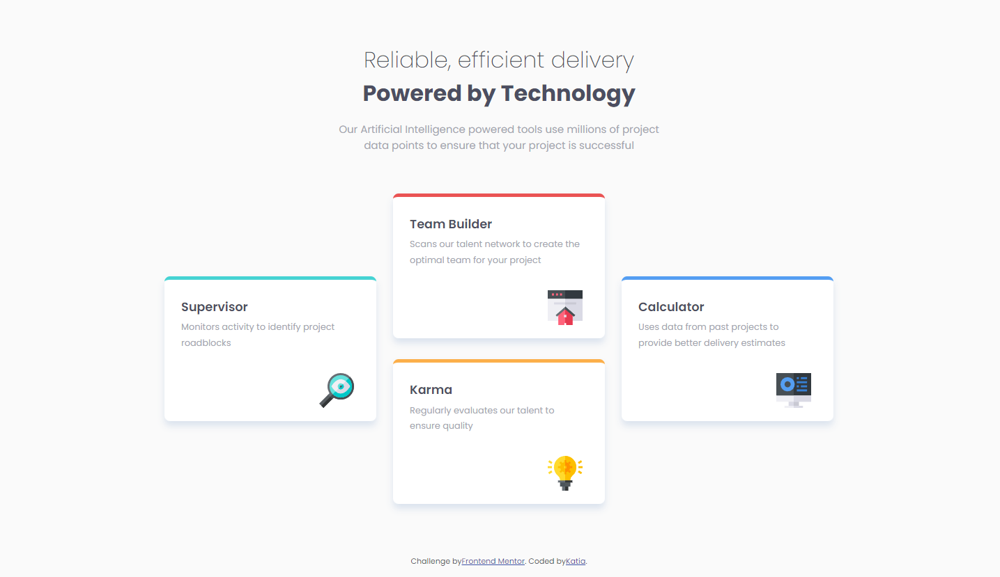
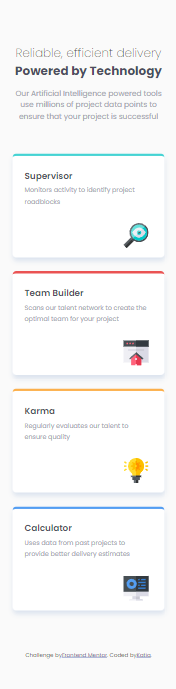

# Frontend Mentor - Four card feature section solution

This is a solution to the [Four card feature section challenge on Frontend Mentor](https://www.frontendmentor.io/challenges/four-card-feature-section-weK1eFYK). Frontend Mentor challenges help you improve your coding skills by building realistic projects. 

## Table of contents

  - [The challenge](#the-challenge)
  - [Screenshot](#screenshot)
- [My process](#my-process)
  - [Built with](#built-with)

### The challenge

Users should be able to:

- View the optimal layout for the site depending on their device's screen size

### Screenshot

## My process

The mobile layout was easy for me, but the desktop layout not even close, I wanted to make the cards move to different places as the window shrinks but it was extremely hard and I couldn´t find any usefull information. I'm going to keep practicing on those types of layouts but this feels kinda like a bummer. 

### Built with

- Semantic HTML5 markup
- CSS custom properties
- Flexbox
- CSS Grid